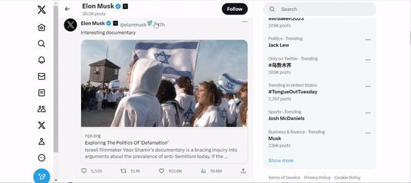

<p align="center">
  
</p>  

# Bot Detective Chrome Extension

## Description
Bot Detective is a machine learning project that classifies Twitter users as bots or not bots based on user metadata. This project was developed to help Twitter users distinguish between real users and automated accounts, which can be used for spamming, spreading false information, and manipulating public opinion.

- **Goals:**
  - Raise bot awerness.
  - Enchanse user's security.
  - Promote a more cautious and critical approach when interacting with unfamiliar users.

#### Model Architecture
The user classification is performed by a Random Forest model, which utilizes the user's metadata collected through the Twitter API.
The ML model we created is based on the article:"Scalable and Generalizable Social Bot Detection through Data Selection", it uses 4 diffrent classified datasets of Twitter users that were manually labeled as bots or not bots based on their metadata, such as the number of followers, following, tweets and likes.
The model was developed using Python and various libraries such as pandas and scikit-learn. 
**Dataset Building:**  The process of constructing the unified dataset is detailed in Build_Dataset.py. The resulting consolidated dataset is available at "Datasets/all_df.csv," while the individual datasets are stored within the "Datasets" folder.
**Model Construction:** For the model creation procedure, you can refer to the Build_model.py. This script also encompasses an analysis of the model's performance against various alternative classifiers.

## Features
Our extension include 2 main feature based on bot classification:
- **Bot/Human indictor:** As users browse through their Twitter feed, they will seamlessly come across visual indicators displaying "Bot" or "Human" sign—generated by the ongoing classification process of the model.<br/> <p align="center">   </p>  
- **Number of bots in 100 randomly chosen followers:** For every user, an analysis of the amount of bots among 100 randomly selected followers is displayed in Profile page.<br/> We can see below an example of bot indicator and number of bots in 100 randomly chosen followers:<p align="center"></p>

## Paper
[Technical Report](https://github.com/stav-bentov/Bot-Detective/blob/main/Project%20Documents/Bot_Detective_Technical_Report.pdf)


## Requirements:
Python 3.8 with the following dependencies:
- fastapi
- uvicorn
- redis
- pickle
- pandas
- nltk.util
- requests
- numpy
- matplotlib
- sklearn.ensemble
- sklearn.model_selection
- sklearn.naive_bayes
- sklearn.calibration
- sklearn.inspection
- sklearn.metrics
- seaborn

## Usage
For using the extension follow the next steps:
1. Clone reposetory.
```
  git clone https://github.com/stav-bentov/Bot-Detective.git
```
2. Open Chrome Extensions on developer mode.
3. Click on "Load unpacked" and choose the folder: `extension` in the cloned project.
4. To run our extension using the local server make sure that the following comments are underlined:
- In API_requests.py:
Make this lines in a comment:
```
app.add_middleware(HTTPSRedirectMiddleware)  # Redirect HTTP to HTTPS
...
uvicorn.run(app, host="0.0.0.0", port=3003, ssl_keyfile="./server.key", ssl_certfile="./server.crt")
```
Make sure this line is not in comment:
```
uvicorn.run(app, port=8000)
```
- In searchAndCalcUsers.js: Make this lines in a comment:
``` 
const response = await fetch(`https://34.165.1.66:3003/isBot/${Object.keys(usersOnRequestDict).join(',')}`);
```
Make sure this line is not in comment:
```
const response = await fetch(`http://127.0.0.1:8000/isBot/${Object.keys(usersOnRequestDict).join(',')}`);
```
- In showBotPrec.js:
Make this lines in a comment:
```
response = await fetch(`https://34.165.1.66:3003/followersBots/?username=${username}&classification=${requestClassification}&followersPrec=${requestFollowersPrec}`);
```
Make sure this line is not in comment:
```
response = await fetch(`http://127.0.0.1:8000/followersBots/?username=${username}&classification=${requestClassification}&followersPrec=${requestFollowersPrec}`);
```
*note: For running our Google Chrome server- do the oopisite (regarding the comments)*

<br/>5. Activate Resid in the server (local or our Google Cloud Server):
```
  sudo service redis-server start
  password: [enter password]
  redis-cli
```
6. Create a file in main directory named `access_keys.py`:
```
  consumer_key = __Fill you consumer key__
  consumer_secret = __Fill you consumer secret__
  bearer_token = __Fill you bearer token__
  access_token_key = __Fill you access token key__
  access_token_secret = __Fill you access token secret__
```
7. Run on the server:
``` 
    python API_requests.py
```
8. Go back to Chrome Extension for developer and activate the extension.
9. You can browse through Twitter and have fun with Bot Detective.

## Files/ Folders Descriptor
- `/extension` Code of extension, including menifest, content scripts and background script.
- `API_requests.py` The server, created by using Fast API, get the requests and generate responses with the help of `Detector.py` that runs the model. 
- `Detector.py` Use the model and Twitter API for calculating results of classification and information about followers. 
- `Build_Dataset.py` Building of united dataset: `Datasets/all_df.csv`, calculate metadata and dervied features.
- `Build_Model.py` Building the Random Forest model based on the united dataset: `Datasets/all_df.csv`. This script includes grid search of Gaussian Naive Bayes, Random Forest and Linear SVC classifiers. 
- `/Datasets` Include classified Twitter users and united dataset `all_df.csv`.
- `/Videos`, `/Articles`,`/Gifs`,`/Photos`, `/Knesset` Folders that are not part of the technical develop of Bot Detctive, read README of them for more info.

## Visual Overview
- #### User's classifications
While browsing- indicators appear, each accompanied by a popup displaying warnings and the classification accuracy (showed when mouse is over it).
<p align="center">   </p> 

- #### Informative Popup
When clicking the bot/human sign, an informative popup is displayed, providing details on scenarios where bots posed a risk by including quotes and links to news and articles.
<p align="center">   </p> 

- #### General Browsing Experience
<p align="center">   </p> 
